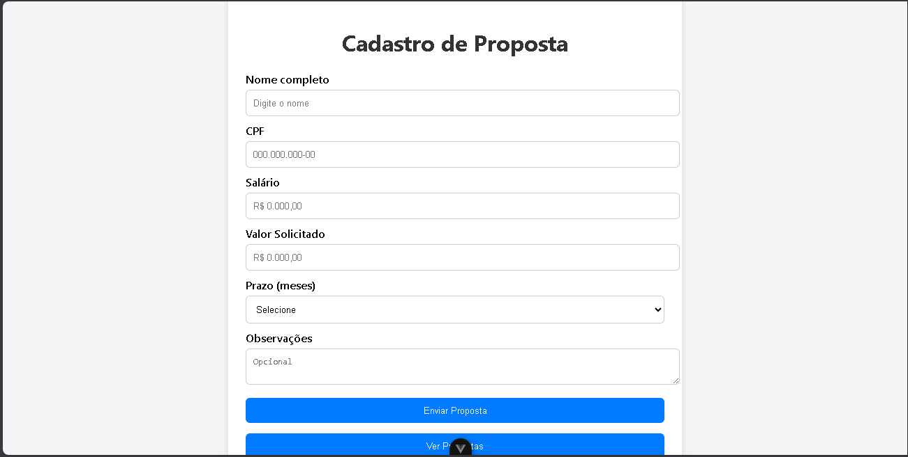
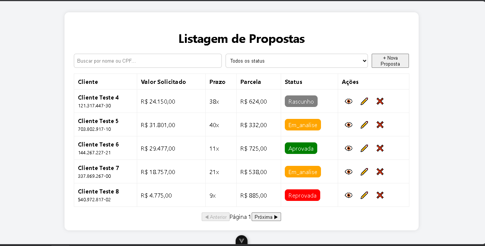

Esse projeto trata-se de um sistema completo para gestão de propostas de crédito, desenvolvido como parte de uma avaliação técnica. Ele é composto por um backend em Laravel (API REST) e um frontend em Vue.js, seguindo boas práticas de arquitetura, validação, segurança e usabilidade.

---

## Tecnologias Utilizadas

### Backend  
- Laravel 11  
- PHP 8.2  
- MySQL  
- Eloquent ORM  
- Form Requests / Resources / Services  
- Validação avançada e tratamento de erros  
- Paginação e filtros automáticos  

### Frontend  
- Vue.js 3 (Composition API)  
- Axios para requisições HTTP  
- Vue Router para navegação  
- Vue The Mask para máscaras de input  
- Estilização com CSS puro  

---

## Estrutura do Projeto

### Backend (`/backend`)  
- `app/Http/Controllers` – Controladores REST responsáveis por receber requisições e devolver respostas.  
- `app/Services` – Lógica de negócio da aplicação, cálculos, validações, regras de status.  
- `app/Http/Requests` – Validações de entrada (Form Requests).  
- `app/Http/Resources` – Transformações das entidades para JSON.  
- `database/migrations` – Migrações de banco de dados.  
- `database/seeders` – Seeders de dados para testes.  
- `routes/api.php` – Rotas da API REST.  

### Frontend (`/frontend` ou raiz conforme estrutura)  
- `src/views` – Páginas principais (Listagem, Cadastro, Detalhes).  
- `src/components` – Componentes reutilizáveis (Modal de detalhes, Filtros).  
- `src/router` – Definição de rotas Vue.  
- `src/services` – Configuração Axios e baseUrl da API.  
- `src/assets` – Imagens e estilos adicionais.  

---

## Instalação e Execução

### 1. Backend  
1. Acesse a pasta `backend`.  
2. Copie o arquivo `.env.example` para `.env` e configure as credenciais do banco.  
3. Rode `composer install`.  
4. Execute migrações e seeds:  
   ```bash
   php artisan migrate --seed
